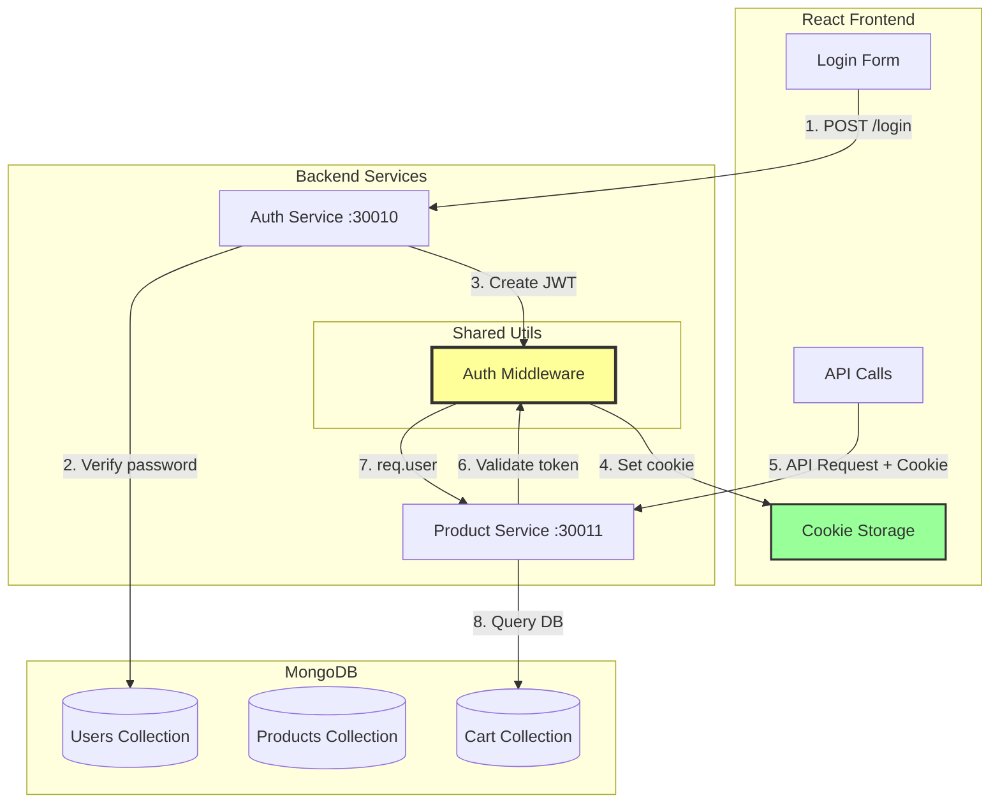

```mermaid
graph TB
    subgraph Frontend["React Frontend"]
        Login[Login Form]
        API[API Calls]
        Storage[Cookie Storage]
    end
    
    subgraph Backend["Backend Services"]
        AuthService[Auth Service :30010]
        ProductService[Product Service :30011]
        
        subgraph Shared["Shared Utils"]
            AuthMiddleware[Auth Middleware]
        end
    end
    
    subgraph Database["MongoDB"]
        UserDB[(Users Collection)]
        ProductDB[(Products Collection)]
        CartDB[(Cart Collection)]
    end
    
    Login -->|1. POST /login| AuthService
    AuthService -->|2. Verify password| UserDB
    AuthService -->|3. Create JWT| AuthMiddleware
    AuthMiddleware -->|4. Set cookie| Storage
    
    API -->|5. API Request + Cookie| ProductService
    ProductService -->|6. Validate token| AuthMiddleware
    AuthMiddleware -->|7. req.user| ProductService
    ProductService -->|8. Query DB| CartDB
    
    style AuthMiddleware fill:#ff9,stroke:#333,stroke-width:3px
    style Storage fill:#9f9,stroke:#333,stroke-width:2px
```