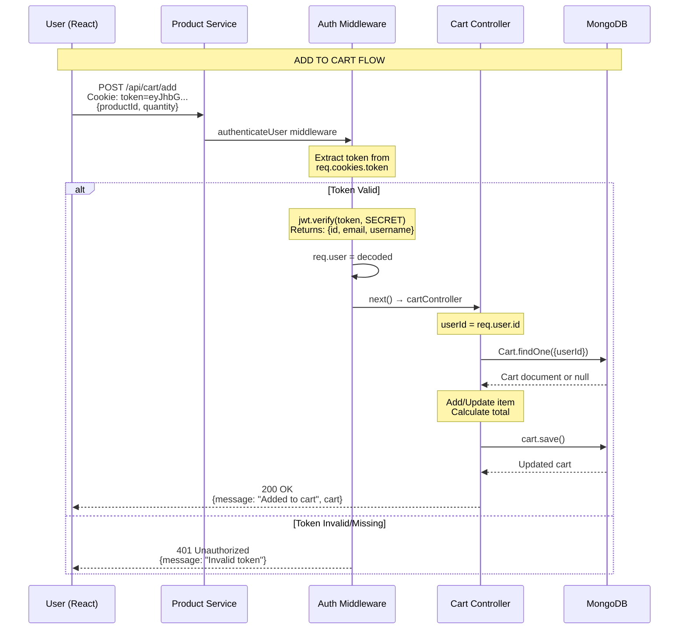

```mermaid
sequenceDiagram
    participant U as User (React)
    participant P as Product Service
    participant M as Auth Middleware
    participant C as Cart Controller
    participant DB as MongoDB
    
    Note over U,DB: ADD TO CART FLOW
    
    U->>P: POST /api/cart/add<br/>Cookie: token=eyJhbG...<br/>{productId, quantity}
    
    P->>M: authenticateUser middleware
    
    Note over M: Extract token from<br/>req.cookies.token
    
    alt Token Valid
        Note over M: jwt.verify(token, SECRET)<br/>Returns: {id, email, username}
        M->>M: req.user = decoded
        M->>C: next() → cartController
        
        Note over C: userId = req.user.id
        
        C->>DB: Cart.findOne({userId})
        DB-->>C: Cart document or null
        
        Note over C: Add/Update item<br/>Calculate total
        
        C->>DB: cart.save()
        DB-->>C: Updated cart
        
        C-->>U: 200 OK<br/>{message: "Added to cart", cart}
        
    else Token Invalid/Missing
        M-->>U: 401 Unauthorized<br/>{message: "Invalid token"}
    end
```

    