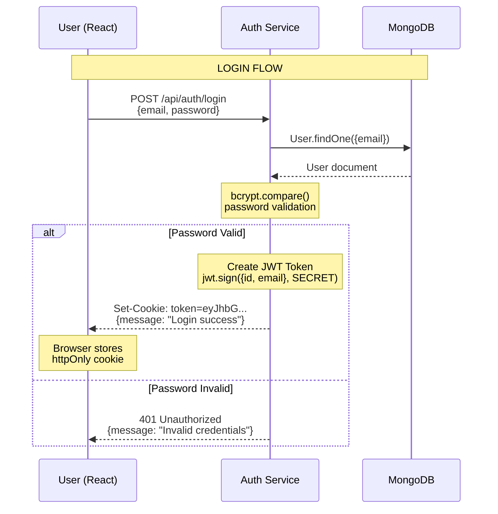

```mermaid
sequenceDiagram
    participant U as User (React)
    participant A as Auth Service
    participant DB as MongoDB
    
    Note over U,DB: LOGIN FLOW
    
    U->>A: POST /api/auth/login<br/>{email, password}
    A->>DB: User.findOne({email})
    DB-->>A: User document
    
    Note over A: bcrypt.compare()<br/>password validation
    
    alt Password Valid
        Note over A: Create JWT Token<br/>jwt.sign({id, email}, SECRET)
        A-->>U: Set-Cookie: token=eyJhbG...<br/>{message: "Login success"}
        Note over U: Browser stores<br/>httpOnly cookie
    else Password Invalid
        A-->>U: 401 Unauthorized<br/>{message: "Invalid credentials"}
    end
```