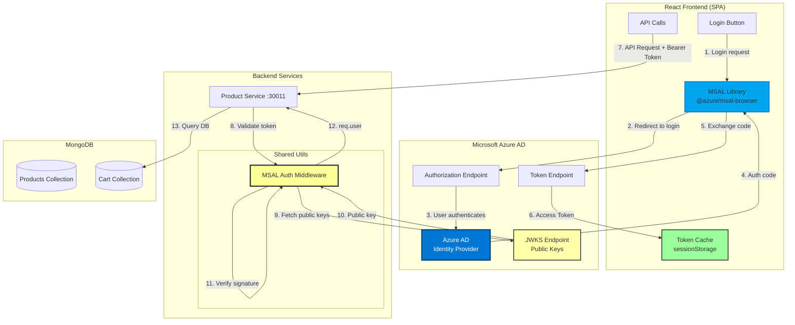

# MSAL Complete Architecture

```mermaid
graph TB
    subgraph Frontend["React Frontend (SPA)"]
        LoginBtn[Login Button]
        MSAL[MSAL Library<br/>@azure/msal-browser]
        TokenCache[Token Cache<br/>sessionStorage]
        APICall[API Calls]
    end
    
    subgraph Azure["Microsoft Azure AD"]
        AzureAD[Azure AD<br/>Identity Provider]
        JWKS[JWKS Endpoint<br/>Public Keys]
        AuthEndpoint[Authorization Endpoint]
        TokenEndpoint[Token Endpoint]
    end
    
    subgraph Backend["Backend Services"]
        ProductService[Product Service :30011]
        
        subgraph Shared["Shared Utils"]
            MSALMiddleware[MSAL Auth Middleware]
        end
    end
    
    subgraph Database["MongoDB"]
        ProductDB[(Products Collection)]
        CartDB[(Cart Collection)]
    end
    
    LoginBtn -->|1. Login request| MSAL
    MSAL -->|2. Redirect to login| AuthEndpoint
    AuthEndpoint -->|3. User authenticates| AzureAD
    AzureAD -->|4. Auth code| MSAL
    MSAL -->|5. Exchange code| TokenEndpoint
    TokenEndpoint -->|6. Access Token| TokenCache
    
    APICall -->|7. API Request + Bearer Token| ProductService
    ProductService -->|8. Validate token| MSALMiddleware
    MSALMiddleware -->|9. Fetch public keys| JWKS
    JWKS -->|10. Public key| MSALMiddleware
    MSALMiddleware -->|11. Verify signature| MSALMiddleware
    MSALMiddleware -->|12. req.user| ProductService
    ProductService -->|13. Query DB| CartDB
    
    style AzureAD fill:#0078d4,stroke:#004578,stroke-width:3px,color:#fff
    style MSAL fill:#00a4ef,stroke:#0078d4,stroke-width:2px
    style MSALMiddleware fill:#ff9,stroke:#333,stroke-width:3px
    style TokenCache fill:#9f9,stroke:#333,stroke-width:2px
    style JWKS fill:#ffa,stroke:#333,stroke-width:2px
```
