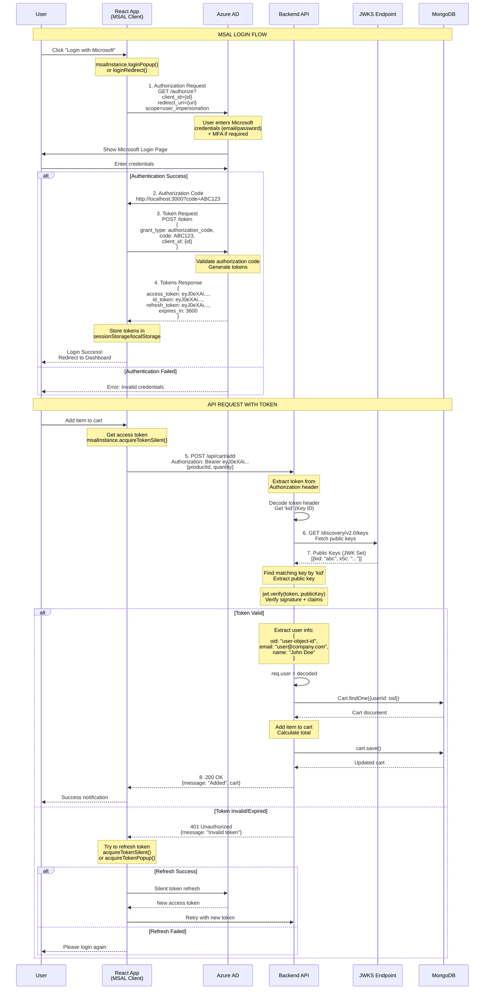

# MSAL Login Flow (Detailed Sequence)

```mermaid
sequenceDiagram
    participant U as User
    participant R as React App<br/>(MSAL Client)
    participant AD as Azure AD
    participant BE as Backend API
    participant JWKS as JWKS Endpoint
    participant DB as MongoDB
    
    Note over U,DB: MSAL LOGIN FLOW
    
    U->>R: Click "Login with Microsoft"
    
    Note over R: msalInstance.loginPopup()<br/>or loginRedirect()
    
    R->>AD: 1. Authorization Request<br/>GET /authorize?<br/>client_id={id}<br/>redirect_uri={uri}<br/>scope=user_impersonation
    
    Note over AD: User enters Microsoft<br/>credentials (email/password)<br/>+ MFA if required
    
    AD->>U: Show Microsoft Login Page
    U->>AD: Enter credentials
    
    alt Authentication Success
        AD->>R: 2. Authorization Code<br/>http://localhost:3000?code=ABC123
        
        R->>AD: 3. Token Request<br/>POST /token<br/>{<br/>  grant_type: authorization_code,<br/>  code: ABC123,<br/>  client_id: {id}<br/>}
        
        Note over AD: Validate authorization code<br/>Generate tokens
        
        AD-->>R: 4. Tokens Response<br/>{<br/>  access_token: eyJ0eXAi...,<br/>  id_token: eyJ0eXAi...,<br/>  refresh_token: eyJ0eXAi...,<br/>  expires_in: 3600<br/>}
        
        Note over R: Store tokens in<br/>sessionStorage/localStorage
        
        R-->>U: Login Success!<br/>Redirect to Dashboard
        
    else Authentication Failed
        AD-->>U: Error: Invalid credentials
    end
    
    Note over U,DB: API REQUEST WITH TOKEN
    
    U->>R: Add item to cart
    
    Note over R: Get access token<br/>msalInstance.acquireTokenSilent()
    
    R->>BE: 5. POST /api/cart/add<br/>Authorization: Bearer eyJ0eXAi...<br/>{productId, quantity}
    
    Note over BE: Extract token from<br/>Authorization header
    
    BE->>BE: Decode token header<br/>Get 'kid' (Key ID)
    
    BE->>JWKS: 6. GET /discovery/v2.0/keys<br/>Fetch public keys
    
    JWKS-->>BE: 7. Public Keys (JWK Set)<br/>[{kid: "abc", x5c: "..."}]
    
    Note over BE: Find matching key by 'kid'<br/>Extract public key
    
    Note over BE: jwt.verify(token, publicKey)<br/>Verify signature + claims
    
    alt Token Valid
        Note over BE: Extract user info:<br/>{<br/>  oid: "user-object-id",<br/>  email: "user@company.com",<br/>  name: "John Doe"<br/>}
        
        BE->>BE: req.user = decoded
        
        BE->>DB: Cart.findOne({userId: oid})
        DB-->>BE: Cart document
        
        Note over BE: Add item to cart<br/>Calculate total
        
        BE->>DB: cart.save()
        DB-->>BE: Updated cart
        
        BE-->>R: 8. 200 OK<br/>{message: "Added", cart}
        R-->>U: Success notification
        
    else Token Invalid/Expired
        BE-->>R: 401 Unauthorized<br/>{message: "Invalid token"}
        
        Note over R: Try to refresh token<br/>acquireTokenSilent()<br/>or acquireTokenPopup()
        
        alt Refresh Success
            R->>AD: Silent token refresh
            AD-->>R: New access token
            R->>BE: Retry with new token
        else Refresh Failed
            R-->>U: Please login again
        end
    end
```
