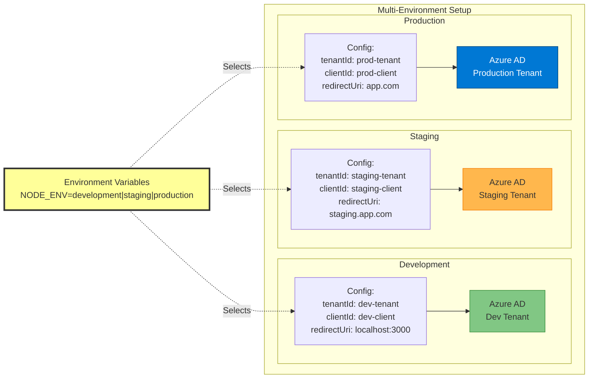

# MSAL Multi-Environment Configuration



## Environment Configuration Example

### Frontend (.env files)

**Development (.env.development)**
```env
REACT_APP_ENV=development
REACT_APP_AZURE_CLIENT_ID_DEV=xxxxxxxx-xxxx-xxxx-xxxx-xxxxxxxxxxxx
REACT_APP_AZURE_TENANT_ID_DEV=yyyyyyyy-yyyy-yyyy-yyyy-yyyyyyyyyyyy
```

**Staging (.env.staging)**
```env
REACT_APP_ENV=staging
REACT_APP_AZURE_CLIENT_ID_STAGING=aaaaaaaa-aaaa-aaaa-aaaa-aaaaaaaaaaaa
REACT_APP_AZURE_TENANT_ID_STAGING=bbbbbbbb-bbbb-bbbb-bbbb-bbbbbbbbbbbb
```

**Production (.env.production)**
```env
REACT_APP_ENV=production
REACT_APP_AZURE_CLIENT_ID_PROD=cccccccc-cccc-cccc-cccc-cccccccccccc
REACT_APP_AZURE_TENANT_ID_PROD=dddddddd-dddd-dddd-dddd-dddddddddddd
```

### Backend (.env files)

**Development**
```env
NODE_ENV=development
AZURE_TENANT_ID_DEV=yyyyyyyy-yyyy-yyyy-yyyy-yyyyyyyyyyyy
AZURE_CLIENT_ID_DEV=xxxxxxxx-xxxx-xxxx-xxxx-xxxxxxxxxxxx
```

**Staging**
```env
NODE_ENV=staging
AZURE_TENANT_ID_STAGING=bbbbbbbb-bbbb-bbbb-bbbb-bbbbbbbbbbbb
AZURE_CLIENT_ID_STAGING=aaaaaaaa-aaaa-aaaa-aaaa-aaaaaaaaaaaa
```

**Production**
```env
NODE_ENV=production
AZURE_TENANT_ID_PROD=dddddddd-dddd-dddd-dddd-dddddddddddd
AZURE_CLIENT_ID_PROD=cccccccc-cccc-cccc-cccc-cccccccccccc
```
