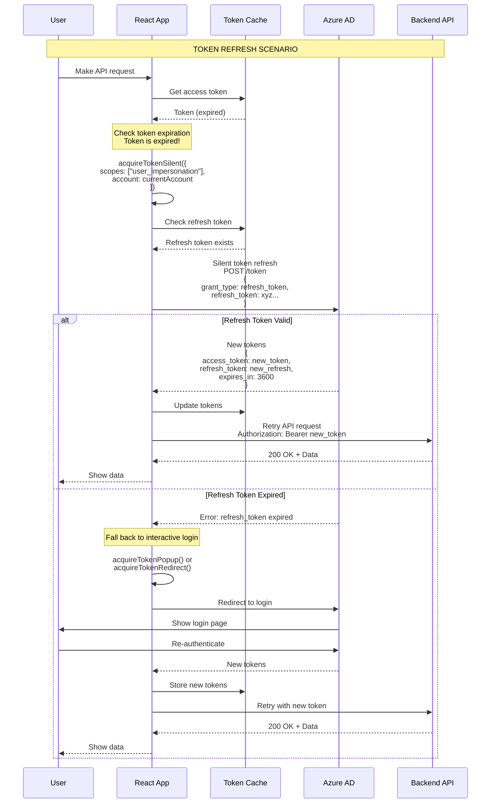

# MSAL Token Refresh Flow



## Token Refresh Strategies

### 1. Silent Token Acquisition (Preferred)
```javascript
try {
    const response = await msalInstance.acquireTokenSilent({
        scopes: ["user_impersonation"],
        account: accounts[0]
    });
    return response.accessToken;
} catch (error) {
    // Falls through to interactive method
}
```

### 2. Interactive Token Acquisition (Fallback)
```javascript
// Popup method
const response = await msalInstance.acquireTokenPopup({
    scopes: ["user_impersonation"],
    account: accounts[0]
});

// OR Redirect method
await msalInstance.acquireTokenRedirect({
    scopes: ["user_impersonation"],
    account: accounts[0]
});
```

## Token Lifetimes

| Token Type | Default Lifetime | Renewable? |
|------------|------------------|------------|
| **Access Token** | 1 hour | Yes (via refresh token) |
| **Refresh Token** | 90 days (inactive)<br/>24 hours (active) | Yes (rolling refresh) |
| **ID Token** | 1 hour | Yes (via refresh token) |
