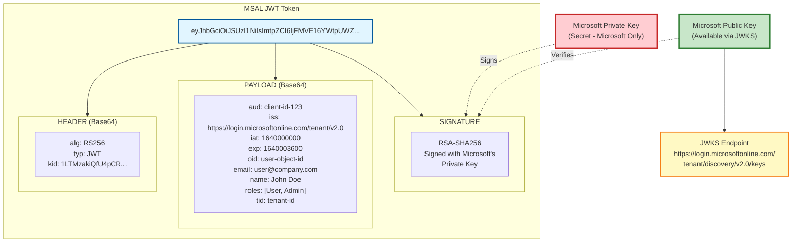

# MSAL Token Structure

## MSAL Token Claims Explained

### Header
- **alg**: Algorithm used (RS256 - RSA with SHA-256)
- **typ**: Token type (JWT)
- **kid**: Key ID used to sign the token

### Payload
- **aud**: Audience (your application's client ID)
- **iss**: Issuer (Microsoft Azure AD)
- **iat**: Issued at timestamp
- **exp**: Expiration timestamp
- **oid**: Object ID (unique user identifier in Azure AD)
- **email**: User's email address
- **name**: User's display name
- **roles**: User's assigned roles
- **tid**: Tenant ID

### Signature
- Signed using Microsoft's private RSA key
- Verified using Microsoft's public key (from JWKS endpoint)
