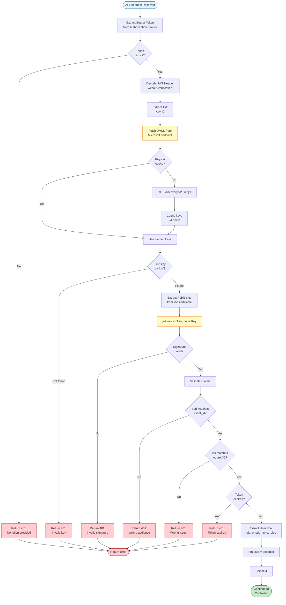

# MSAL Token Validation Process

```mermaid
flowchart TD
    Start([API Request Received]) --> ExtractToken[Extract Bearer Token<br/>from Authorization header]
    
    ExtractToken --> CheckToken{Token<br/>exists?}
    CheckToken -->|No| Error401[Return 401:<br/>No token provided]
    CheckToken -->|Yes| DecodeHeader[Decode JWT Header<br/>without verification]
    
    DecodeHeader --> GetKid[Extract 'kid'<br/>Key ID]
    GetKid --> FetchJWKS[Fetch JWKS from<br/>Microsoft endpoint]
    
    FetchJWKS --> CacheCheck{Keys in<br/>cache?}
    CacheCheck -->|Yes| GetFromCache[Use cached keys]
    CacheCheck -->|No| FetchFromMS[GET /discovery/v2.0/keys]
    
    FetchFromMS --> CacheKeys[Cache keys<br/>24 hours]
    CacheKeys --> GetFromCache
    
    GetFromCache --> FindKey{Find key<br/>by 'kid'?}
    FindKey -->|Not found| Error401b[Return 401:<br/>Invalid key]
    FindKey -->|Found| ExtractPublicKey[Extract Public Key<br/>from x5c certificate]
    
    ExtractPublicKey --> VerifyToken[jwt.verify token, publicKey]
    
    VerifyToken --> CheckSignature{Signature<br/>valid?}
    CheckSignature -->|No| Error401c[Return 401:<br/>Invalid signature]
    CheckSignature -->|Yes| ValidateClaims[Validate Claims]
    
    ValidateClaims --> CheckAudience{aud matches<br/>client_id?}
    CheckAudience -->|No| Error401d[Return 401:<br/>Wrong audience]
    CheckAudience -->|Yes| CheckIssuer{iss matches<br/>Azure AD?}
    
    CheckIssuer -->|No| Error401e[Return 401:<br/>Wrong issuer]
    CheckIssuer -->|Yes| CheckExpiry{Token<br/>expired?}
    
    CheckExpiry -->|Yes| Error401f[Return 401:<br/>Token expired]
    CheckExpiry -->|No| ExtractUser[Extract User Info:<br/>oid, email, name, roles]
    
    ExtractUser --> SetReqUser[req.user = decoded]
    SetReqUser --> CallNext[Call next]
    CallNext --> Success([Continue to<br/>Controller])
    
    Error401 --> End([Return Error])
    Error401b --> End
    Error401c --> End
    Error401d --> End
    Error401e --> End
    Error401f --> End
    
    style Start fill:#e1f5ff,stroke:#01579b
    style Success fill:#c8e6c9,stroke:#2e7d32
    style Error401 fill:#ffcdd2,stroke:#c62828
    style Error401b fill:#ffcdd2,stroke:#c62828
    style Error401c fill:#ffcdd2,stroke:#c62828
    style Error401d fill:#ffcdd2,stroke:#c62828
    style Error401e fill:#ffcdd2,stroke:#c62828
    style Error401f fill:#ffcdd2,stroke:#c62828
    style End fill:#ffcdd2,stroke:#c62828
    style FetchJWKS fill:#fff9c4,stroke:#f57f17
    style VerifyToken fill:#fff9c4,stroke:#f57f17
```
