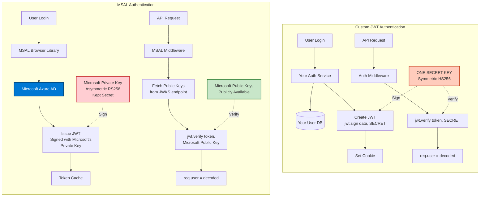

# MSAL vs Custom JWT Comparison

## Key Differences

| Feature | Custom JWT | MSAL |
|---------|-----------|------|
| **Token Issuer** | Your auth-service | Microsoft Azure AD |
| **Algorithm** | HS256 (Symmetric) | RS256 (Asymmetric) |
| **Secret Key** | Your JWT_SECRET | Microsoft's Private Key |
| **Verification** | jwt.verify(token, SECRET) | jwt.verify(token, PublicKey) |
| **User Management** | Your MongoDB | Azure AD |
| **MFA Support** | Manual implementation | Built-in |
| **SSO** | Manual implementation | Built-in |
| **Token Storage** | Cookies | sessionStorage/localStorage |
