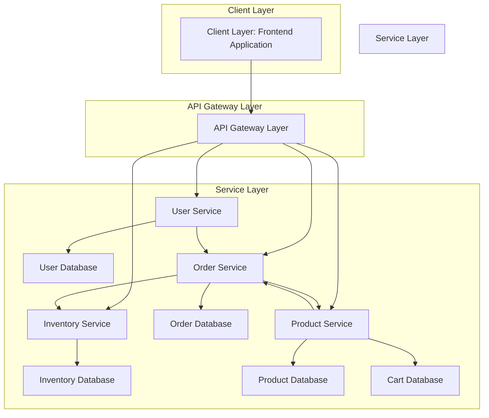

# MicroMart Application Flow Diagram

## Client Layer
- **Client Application**: The client layer consists of the front-end application located in the `client/` folder. It includes components such as:
  - `AuthForm.js`: Handles user authentication forms (login/signup).
  - `Header.js`, `Footer.js`: UI components for navigation and footer.
  - `MainPage.js`: Main landing page for the application.
  - `Signin.js`, `Signup.js`: Pages for user sign-in and sign-up.
  - `Parent.js`, `Child.js`: Components for hierarchical data representation.

The client communicates with the service layer via API calls to the respective microservices.

---

## Service Layer
The service layer consists of the following microservices:

### 1. **User Service**
- **Purpose**: Manages user authentication, registration, and user-related operations.
- **Endpoints**:
  - `POST /user/signup`: Registers a new user.
  - `POST /user/signin`: Authenticates a user and provides a JWT token.
  - `GET /user/profile`: Retrieves user profile information.
- **Communication**:
  - Communicates with the `inventory-service` and `order-service` for user-specific data.
- **Database**:
  - **User Database**: Stores user information such as credentials and profile details.

### 2. **Inventory Service**
- **Purpose**: Manages inventory-related operations.
- **Endpoints**:
  - `GET /inventory`: Retrieves a list of available inventory items.
  - `POST /inventory`: Adds a new inventory item.
  - `PUT /inventory/:id`: Updates an inventory item.
  - `DELETE /inventory/:id`: Deletes an inventory item.
- **Communication**:
  - Communicates with the `order-service` to update inventory based on orders.
- **Database**:
  - **Inventory Database**: Stores inventory details such as item name, quantity, and price.

### 3. **Order Service**
- **Purpose**: Handles order management and processing.
- **Endpoints**:
  - `GET /orders`: Retrieves a list of orders.
  - `POST /orders`: Creates a new order.
  - `PUT /orders/:id`: Updates an order.
  - `DELETE /orders/:id`: Cancels an order.
- **Communication**:
  - Communicates with the `user-service` for user authentication and order history.
  - Communicates with the `inventory-service` to check and update inventory.
- **Database**:
  - **Order Database**: Stores order details such as order ID, user ID, and order status.

### 4. **Product Service**
- **Purpose**: Manages product-related operations.
- **Endpoints**:
  - `GET /products`: Retrieves a list of products.
  - `POST /products`: Adds a new product.
  - `PUT /products/:id`: Updates a product.
  - `DELETE /products/:id`: Deletes a product.
  - `POST /cart`: Adds items to the cart.
  - `GET /cart`: Retrieves cart details.
- **Communication**:
  - Communicates with the `order-service` to process cart checkout.
- **Database**:
  - **Product Database**: Stores product details such as product name, description, price, and stock.
  - **Cart Database**: Stores cart details for users.

---

## Database Layer
Each microservice has its own dedicated database:

- **User Database**: Stores user-related data.
- **Inventory Database**: Stores inventory-related data.
- **Order Database**: Stores order-related data.
- **Product Database**: Stores product and cart-related data.

---

## Communication Flow
1. **Client to Service Layer**:
   - The client application communicates with the service layer via RESTful API calls.
   - Example: User logs in via `POST /user/signin`, receives a JWT token, and uses it for subsequent requests.

2. **Service-to-Service Communication**:
   - **User Service**:
     - Shares user authentication and profile data with `order-service`.
   - **Inventory Service**:
     - Updates inventory based on orders from `order-service`.
   - **Order Service**:
     - Retrieves user data from `user-service`.
     - Updates inventory via `inventory-service`.
     - Processes cart data from `product-service`.
   - **Product Service**:
     - Shares cart data with `order-service` for checkout.

This architecture ensures modularity, scalability, and maintainability of the MicroMart application.

---

## Mermaid Diagram

